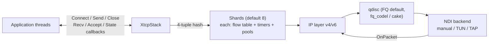

# XTCP

> Language: **English** | [中文](README_CN.md)

XTCP is a user-space TCP/IP protocol stack written in C++17. It terminates
TCP as a static library inside your process: packets enter through a
network-device interface (NDI) you implement or select (in-memory manual
backend, TUN/TAP on Linux), and connections are exposed through an
event-callback API shaped like a socket layer. It is built for user-space
VPN and packet-processing products that need to replace a bundled lwIP-style
stack without changing the surrounding architecture.

Scope statement, stated plainly:

- XTCP implements TCP over IPv4 and IPv6 with the option set listed below.
  It does not implement UDP, sockets-file-descriptor semantics, or a POSIX
  portability shim.
- The congestion-control and queueing interfaces follow the shape of the
  Linux kernel (`tcp_congestion_ops`, `sch_fq`) so that ports of existing
  algorithms stay close to their reference implementations.
- Every performance number in this document was measured by the commands
  shown in [docs/PERFORMANCE.md](docs/PERFORMANCE.md) on the hardware and
  software versions listed there. No number is projected or estimated.

## Architecture



One shard owns all state for the flows hashed to it: flow table, timers,
buffer pools, and a single lock. Cross-shard work passes zero-copy
`BufRef` handles instead of copying payload. The full layer-by-layer
design, data path, and locking rules are documented in
[docs/ARCHITECTURE.md](docs/ARCHITECTURE.md).

## Protocol support

| Area | Supported |
|---|---|
| Base FSM | RFC 793 handshake/teardown, simultaneous open/close, data piggybacked on SYN-RCVD |
| Attack mitigation | RFC 5961 blind-RST/SYN attack mitigation, malformed-option rejection, sequence-wrap handling |
| Retransmission | RFC 6298 RTO with exponential backoff, 3-dupack fast retransmit, RFC 5827 Early Retransmit, RFC 8985 TLP with RACK, RFC 2883 D-SACK undo, RFC 3522 Eifel spurious-retransmit detection, RFC 6937 PRR |
| Reordering | Out-of-order queue with capacity limits, RFC 2018 SACK blocks (negotiated) |
| Window/Options | RFC 7323 window scaling and timestamps (PAWS), RFC 879 MSS, TCP-MD5 RFC 2385 |
| Congestion | KCC (default), Reno, CUBIC, BBRv1; runtime hot-swap per listener without dropping live flows |
| ECN | RFC 3168 negotiation and CE handling, wired into CC |
| TFO | RFC 7413 server cookies and client connect mode |
| Keepalive/persist | RFC 1122 delayed ACK, zero-window persist timer, keepalive idle/intvl/cnt |
| Defense | SYN cookies under flood, fragment-bomb caps, challenge ACKs |
| qdisc | FQ (default), fq_codel, CAKE-style, TBF; runtime registration and per-listener selection |
| Options API | Linux `setsockopt`-style ids: `TCP_NODELAY`, `TCP_MAXSEG`, `TCP_KEEPIDLE/INTVL/CNT`, `TCP_SYNCNT`, `TCP_QUICKACK`, `TCP_FASTOPEN(+CONNECT)`, `TCP_USER_TIMEOUT`, `TCP_DEFER_ACCEPT`, `TCP_ECN`, `TCP_NO_SACK_PERMITTED`; `TCP_CORK` is accepted as a no-op in v1 |

## Measured performance

Summary; full methodology, raw outputs, and environment tables are in
[docs/PERFORMANCE.md](docs/PERFORMANCE.md). All figures are from the exact
commands listed there, best of 3 rounds unless stated.

| Test | Environment | Result |
|---|---|---|
| Loopback throughput, 1460 B writes | Windows host, in-process manual backend | 24.6 Gbps (64 MB), 25.5 Gbps (256 MB), ~3.16 Mpps |
| Loopback throughput, Reno CC | same | 24.0 Gbps |
| Loopback throughput, 64 KB writes | same | 23.7 Gbps (rounds varied 12.1–23.7) |
| Loopback throughput, 64 B writes | same | 1.27 Gbps / 3.73 Mpps (packet-rate bound) |
| Multi-worker RX injection | same, 1 worker | 135.2 Gbps / 11.6 Mpps |
| Multi-worker RX injection | same, 8 workers | 98.9 Gbps / 8.47 Mpps aggregate |
| Connection establishment | same | 566k conns/s sustained over 200k connects |
| Connection-table sweep | same | idle 0.02 µs/round; dirty 348 ns/conn/round at 10k conns |
| RTT latency over TUN, 2000×1 KB | WSL2 Ubuntu 24.04, root TUN | p50 194–204 µs, p99 260–267 µs, jitter 17–21 µs, 0 failures |
| One-way bulk over TUN, 16 MB | same | 1.79–1.81 Gbps (kernel loopback baseline on same host: 21–31 Gbps) |
| Fairness, 4 flows under tbf+netem | same | shares 24.7–25.3 % each, Jain index 0.9999 |

Quality gates behind these numbers:

- Deterministic test suite (virtual clock): every registered test passes on
  Windows MSVC Release and under `qemu-aarch64` (static cross-build);
  236 targets by default, 237 with the optional lwIP differential layer.
- CI runs the suite under ASan+UBSan on Linux (clang++ and g++) and on
  Windows MSVC; leak-free and crash-free is a merge requirement.

## Known limitations

Stated so you can evaluate fit honestly:

1. **TUN path is driver-bound.** One-way bulk over TUN reaches ~1.8 Gbps
   while the kernel loopback baseline on the same host is 21–31 Gbps. This
   is the TUN character-device copy cost, not the TCP stack; applications
   needing more must use a faster NDI backend (DPDK/EFVI backends are
   reserved but not implemented).
2. **RX worker scaling is sub-linear.** Under the synthetic segment-
   injection benchmark, 8 workers aggregate to 98.9 Gbps versus 135.2 Gbps
   for one worker. Treat multi-core numbers as measured points, not a
   scaling law.
3. **Small packets are pps-bound.** A single flow of 64 B writes tops out
   near 3.7 Mpps / 1.27 Gbps.
4. **TUN interop samples require Linux and root** (`/dev/net/tun`). They do
   not build on Windows hosts.
5. **The lwIP differential-testing layer is optional** and requires vendored
   lwIP sources (`XTCP_BUILD_LWIP=ON`); it is not part of the default build.
6. **`TCP_CORK` is accepted and ignored** in v1 (documented in
   `include/xtcp/options/options.h`).
7. **Timing-sensitive tests need relaxed deadlines under QEMU**, because
   single-core emulation distorts wall-clock pacing; the suite remains
   deterministic by virtual clock elsewhere.

## Quick start

Build and run the test suite:

```bash
# Linux / WSL
cmake -B build -DCMAKE_BUILD_TYPE=Release \
      -DXTCP_BUILD_TESTS=ON -DXTCP_BUILD_BENCH=ON
cmake --build build -j$(nproc)
ctest --test-dir build --output-on-failure

# Sanitizer build
cmake -B build-asan -DCMAKE_BUILD_TYPE=Debug -DXTCP_SANITIZE=ON \
      -DXTCP_BUILD_TESTS=ON
cmake --build build-asan -j$(nproc) && ctest --test-dir build-asan

# Windows (MSVC)
cmake -B build -G "Visual Studio 17 2022" -A x64 \
      -DXTCP_BUILD_TESTS=ON -DXTCP_BUILD_BENCH=ON
cmake --build build --config Release
ctest --test-dir build -C Release --output-on-failure

# Android NDK (arm64-v8a)
cmake -B build-ndk -G Ninja \
  -DCMAKE_TOOLCHAIN_FILE=$NDK/build/cmake/android.toolchain.cmake \
  -DANDROID_ABI=arm64-v8a -DANDROID_PLATFORM=android-24 \
  -DXTCP_BUILD_TESTS=ON
cmake --build build-ndk
```

Minimal two-stack echo (the complete program is
`samples/echo.cpp`; both stacks live in one process and exchange packets
through in-memory backends):

```cpp
#include <xtcp/core/stack.h>
#include <xtcp/ndi/manual.h>

xtcp::buf::InitPools();
xtcp::ndi::ManualBackend server_backend, client_backend;
xtcp::XtcpStack server_stack(&server_backend), client_stack(&client_backend);

// Wire the two backends together (each Tx becomes the peer's Rx).
server_backend.SetRxHandler([&](xtcp::ndi::Packet&& p) {
    xtcp::buf::BufRef buf = xtcp::buf::BufRef::Acquire(p.len);
    if (buf.IsEmpty()) return;
    std::memcpy(buf.Data(), p.data, p.len);
    buf.SetLen(p.len);
    server_stack.OnPacket(std::move(buf));
});
// ... same for client_backend -> client_stack ...

xtcp::core::Endpoint local{};         // 10.0.0.2:8080
local.family = 4;
local.addr[0] = 0x0A000002;
local.port = 8080;
server_stack.Listen(local);
server_stack.SetAcceptHandler([](UInt64, const xtcp::core::Endpoint&,
                                 const xtcp::core::Endpoint&) { return true; });
server_stack.SetRecvHandler([&](UInt64 id, const Byte* data, UInt32 len) {
    server_stack.Send(id, data, len); // echo
});

xtcp::core::Endpoint remote{};        // connect 10.0.0.1 -> 10.0.0.2:8080
remote.family = 4;
remote.addr[0] = 0x0A000002;
remote.port = 8080;
const UInt64 conn = client_stack.Connect(local_of_client, remote);
client_stack.Send(conn, payload, size);
client_stack.Close(conn);
xtcp::buf::ShutdownPools();
```

Interop samples over a real kernel TUN device (Linux, root):

```bash
sudo ./build/interop_tun       # kernel<->xtcp bidirectional echo + integrity
sudo ./build/interop_perf      # one-way bulk throughput over TUN
sudo ./build/interop_latency   # RTT p50/p95/p99/jitter, 2000 rounds
sudo ./build/interop_fair      # 4-flow fairness under tbf+netem, Jain index
sudo ./build/interop_loss --combo  # loss 1% + reorder 5% + 40ms delay recovery
```

## Documentation

| Document | Content |
|---|---|
| [docs/INDEX.md](docs/INDEX.md) | Documentation map and reading order |
| [docs/ARCHITECTURE.md](docs/ARCHITECTURE.md) | Layer design, data path, sharding, buffers, FSM, CC/qdisc plugins, locking rules |
| [docs/PERFORMANCE.md](docs/PERFORMANCE.md) | Measurement methodology, environments, raw results, interpretation, limitations |
| [docs/BUILDING.md](docs/BUILDING.md) | Platform/toolchain matrix, cross-compilation, sanitizer and QEMU recipes |
| [docs/USAGE.md](docs/USAGE.md) | Getting started, API walkthrough, options reference, qdisc usage, plugin authoring |
| [docs/TESTING.md](docs/TESTING.md) | Suite organization, determinism model, verification records |
| [docs/GOALS.md](docs/GOALS.md) | Project goals and acceptance criteria |
| [docs/CODING_STYLE.md](docs/CODING_STYLE.md) | Code conventions enforced in review |
| [docs/CC_PORTING.md](docs/CC_PORTING.md) | Porting a kernel congestion-control algorithm |

Chinese versions of every document carry the `_CN` suffix
([README_CN.md](README_CN.md), [docs/INDEX_CN.md](docs/INDEX_CN.md), ...).
