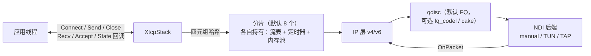

# XTCP

> 语言：[English](README.md) | **中文**

XTCP 是一个用 C++17 编写的用户态 TCP/IP 协议栈。它以静态库的形式在进程内
终结 TCP：报文通过你实现或选择的网络设备接口（NDI）进入（进程内 manual
后端、Linux 上的 TUN/TAP），连接则通过一套事件回调 API 暴露，形态与套接字
层一致。它的目标场景是用户态 VPN 与报文处理产品——在不改动周边架构的前提
下，替换内置的 lwIP 类协议栈。

先把边界说清楚：

- XTCP 实现的是 IPv4 与 IPv6 之上的 TCP，以及下文列出的选项集。它不实现
  UDP、不提供文件描述符式的 socket 语义、也不做 POSIX 兼容层。
- 拥塞控制与队列规则的接口沿用了 Linux 内核的形态（`tcp_congestion_ops`、
  `sch_fq`），使既有算法的移植尽量贴近其参考实现。
- 本文档中的每一个性能数字都来自 [docs/PERFORMANCE_CN.md](docs/PERFORMANCE_CN.md)
  所列命令在所列硬件与软件版本上的实测。没有任何数字是推算或预估。

## 架构



每个分片独占哈希到它的全部流状态：流表、定时器、缓冲池和一把锁。跨分片
传递零拷贝 `BufRef` 句柄而非拷贝载荷。逐层设计、数据路径与加锁规则见
[docs/ARCHITECTURE_CN.md](docs/ARCHITECTURE_CN.md)。

## 协议支持

| 领域 | 支持内容 |
|---|---|
| 基础状态机 | RFC 793 三次握手/四次挥手、同时打开/同时关闭、SYN-RCVD 段捎带数据 |
| 攻击缓解 | RFC 5961 盲 RST/SYN 攻击缓解、畸形选项拒绝、序号回绕处理 |
| 重传 | RFC 6298 RTO 指数退避、3-dupack 快速重传、RFC 5827 Early Retransmit、RFC 8985 TLP+RACK、RFC 2883 D-SACK undo、RFC 3522 Eifel 伪重传检测、RFC 6937 PRR |
| 乱序 | 乱序队列（容量受限）、RFC 2018 SACK 块（协商开启） |
| 窗口/选项 | RFC 7323 窗口缩放与时间戳（PAWS）、RFC 879 MSS、TCP-MD5 RFC 2385 |
| 拥塞控制 | KCC（默认）、Reno、CUBIC、BBRv1；运行时按监听器热切换，不断开存量连接 |
| ECN | RFC 3168 协商与 CE 处理，接入拥塞控制 |
| TFO | RFC 7413 服务端 cookie 与客户端 connect 模式 |
| 保活/持续窗口 | RFC 1122 延迟 ACK、零窗口 persist 定时器、keepalive idle/intvl/cnt |
| 防御 | SYN flood 下启用 SYN cookies、分片炸弹上限、challenge ACK |
| qdisc | FQ（默认）、fq_codel、CAKE 风格、TBF；运行时注册、按监听器选择 |
| 选项 API | Linux `setsockopt` 风格 id：`TCP_NODELAY`、`TCP_MAXSEG`、`TCP_KEEPIDLE/INTVL/CNT`、`TCP_SYNCNT`、`TCP_QUICKACK`、`TCP_FASTOPEN(+CONNECT)`、`TCP_USER_TIMEOUT`、`TCP_DEFER_ACCEPT`、`TCP_ECN`、`TCP_NO_SACK_PERMITTED`；`TCP_CORK` 在 v1 接受但为空操作 |

## 实测性能

以下为摘要；完整方法学、原始输出与环境表见
[docs/PERFORMANCE_CN.md](docs/PERFORMANCE_CN.md)。所有数字均来自该文档所列
的确切命令，除注明外取 3 轮中的最优值。

| 测试 | 环境 | 结果 |
|---|---|---|
| 环回吞吐，1460 B 写入 | Windows 主机，进程内 manual 后端 | 24.6 Gbps（64 MB）、25.5 Gbps（256 MB），约 3.16 Mpps |
| 环回吞吐，Reno CC | 同上 | 24.0 Gbps |
| 环回吞吐，64 KB 写入 | 同上 | 23.7 Gbps（各轮波动 12.1–23.7） |
| 环回吞吐，64 B 写入 | 同上 | 1.27 Gbps / 3.73 Mpps（受包速率限制） |
| 多 worker RX 注入 | 同上，1 worker | 135.2 Gbps / 11.6 Mpps |
| 多 worker RX 注入 | 同上，8 workers | 聚合 98.9 Gbps / 8.47 Mpps |
| 连接建立速率 | 同上 | 20 万次连续建连，持续 566k conns/s |
| 连接表扫描 | 同上 | idle 0.02 µs/轮；1 万连接 dirty 348 ns/conn/轮 |
| TUN 往返延迟，2000×1 KB | WSL2 Ubuntu 24.04，root TUN | p50 194–204 µs，p99 260–267 µs，抖动 17–21 µs，0 失败 |
| TUN 单向批量，16 MB | 同上 | 1.79–1.81 Gbps（同主机内核环回基线 21–31 Gbps） |
| 公平性，tbf+netem 下 4 流 | 同上 | 各流占比 24.7–25.3 %，Jain 指数 0.9999 |

这些数字背后的质量门：

- 确定性测试套件（虚拟时钟驱动）：Windows MSVC Release 与 `qemu-aarch64`
  （静态交叉构建）下注册项全部通过；默认 236 项目标，含可选 lwIP 差分层
  时 237 项。
- CI 在 Linux（clang++ 与 g++）ASan+UBSan 及 Windows MSVC 下运行全量套件；
  零泄漏零崩溃是合并的必要条件。

## 已知局限

如实列出，便于评估适配性：

1. **TUN 路径受驱动限制。** 经 TUN 的单向批量约 1.8 Gbps，而同主机内核
   环回基线为 21–31 Gbps。瓶颈在 TUN 字符设备的拷贝成本，不在 TCP 栈；
   需要更高吞吐的应用必须换更快的 NDI 后端（DPDK/EFVI 后端为预留接口，
   尚未实现）。
2. **RX worker 扩展性次线性。** 在合成段注入基准下，8 worker 聚合
   98.9 Gbps，低于单 worker 的 135.2 Gbps。多核数字应视为实测点，而非
   扩展律。
3. **小包受包速率限制。** 单流 64 B 写入上限约 3.7 Mpps / 1.27 Gbps。
4. **TUN 互操作样例需要 Linux 与 root**（`/dev/net/tun`），Windows 主机
   不参与构建。
5. **lwIP 差分测试层为可选项**，需要内置 lwIP 源码（`XTCP_BUILD_LWIP=ON`），
   不在默认构建内。
6. **`TCP_CORK` 接受但忽略**（v1 行为，见
   `include/xtcp/options/options.h` 文档注释）。
7. **QEMU 下时序敏感测试需放宽截止时间**：单核仿真会扭曲墙钟节奏；其余
   场景套件由虚拟时钟保证确定性。

## 快速上手

构建并运行测试套件：

```bash
# Linux / WSL
cmake -B build -DCMAKE_BUILD_TYPE=Release \
      -DXTCP_BUILD_TESTS=ON -DXTCP_BUILD_BENCH=ON
cmake --build build -j$(nproc)
ctest --test-dir build --output-on-failure

# Sanitizer 构建
cmake -B build-asan -DCMAKE_BUILD_TYPE=Debug -DXTCP_SANITIZE=ON \
      -DXTCP_BUILD_TESTS=ON
cmake --build build-asan -j$(nproc) && ctest --test-dir build-asan

# Windows（MSVC）
cmake -B build -G "Visual Studio 17 2022" -A x64 \
      -DXTCP_BUILD_TESTS=ON -DXTCP_BUILD_BENCH=ON
cmake --build build --config Release
ctest --test-dir build -C Release --output-on-failure

# Android NDK（arm64-v8a）
cmake -B build-ndk -G Ninja \
  -DCMAKE_TOOLCHAIN_FILE=$NDK/build/cmake/android.toolchain.cmake \
  -DANDROID_ABI=arm64-v8a -DANDROID_PLATFORM=android-24 \
  -DXTCP_BUILD_TESTS=ON
cmake --build build-ndk
```

最小双栈 echo（完整程序见 `samples/echo.cpp`；两个栈同进程，经内存后端
互发包）：

```cpp
#include <xtcp/core/stack.h>
#include <xtcp/ndi/manual.h>

xtcp::buf::InitPools();
xtcp::ndi::ManualBackend server_backend, client_backend;
xtcp::XtcpStack server_stack(&server_backend), client_stack(&client_backend);

// 把两个后端接起来（一端的 Tx 成为对端的 Rx）。
server_backend.SetRxHandler([&](xtcp::ndi::Packet&& p) {
    xtcp::buf::BufRef buf = xtcp::buf::BufRef::Acquire(p.len);
    if (buf.IsEmpty()) return;
    std::memcpy(buf.Data(), p.data, p.len);
    buf.SetLen(p.len);
    server_stack.OnPacket(std::move(buf));
});
// ... client_backend -> client_stack 同理 ...

xtcp::core::Endpoint local{};         // 10.0.0.2:8080
local.family = 4;
local.addr[0] = 0x0A000002;
local.port = 8080;
server_stack.Listen(local);
server_stack.SetAcceptHandler([](UInt64, const xtcp::core::Endpoint&,
                                 const xtcp::core::Endpoint&) { return true; });
server_stack.SetRecvHandler([&](UInt64 id, const Byte* data, UInt32 len) {
    server_stack.Send(id, data, len); // 回显
});

xtcp::core::Endpoint remote{};        // 客户端 10.0.0.1 -> 10.0.0.2:8080
remote.family = 4;
remote.addr[0] = 0x0A000002;
remote.port = 8080;
const UInt64 conn = client_stack.Connect(local_of_client, remote);
client_stack.Send(conn, payload, size);
client_stack.Close(conn);
xtcp::buf::ShutdownPools();
```

基于真实内核 TUN 设备的互操作样例（Linux，root）：

```bash
sudo ./build/interop_tun       # 内核<->xtcp 双向 echo + 数据完整性
sudo ./build/interop_perf      # TUN 单向批量吞吐
sudo ./build/interop_latency   # RTT p50/p95/p99/抖动，2000 轮
sudo ./build/interop_fair      # tbf+netem 下 4 流公平性（Jain 指数）
sudo ./build/interop_loss --combo  # 丢包 1% + 乱序 5% + 40ms 时延的恢复
```

## 文档

| 文档 | 内容 |
|---|---|
| [docs/INDEX_CN.md](docs/INDEX_CN.md) | 文档地图与阅读顺序 |
| [docs/ARCHITECTURE_CN.md](docs/ARCHITECTURE_CN.md) | 分层设计、数据路径、分片、缓冲、状态机、CC/qdisc 插件、加锁规则 |
| [docs/PERFORMANCE_CN.md](docs/PERFORMANCE_CN.md) | 测量方法学、环境、原始结果、解读、局限 |
| [docs/BUILDING_CN.md](docs/BUILDING_CN.md) | 平台/工具链矩阵、交叉编译、sanitizer 与 QEMU 配方 |
| [docs/USAGE_CN.md](docs/USAGE_CN.md) | 上手指南、API 走读、选项参考、qdisc 用法、插件编写 |
| [docs/TESTING_CN.md](docs/TESTING_CN.md) | 套件组织、确定性模型、验证记录 |
| [docs/GOALS_CN.md](docs/GOALS_CN.md) | 项目目标与验收标准 |
| [docs/CODING_STYLE_CN.md](docs/CODING_STYLE_CN.md) | 评审执行的代码规范 |
| [docs/CC_PORTING_CN.md](docs/CC_PORTING_CN.md) | 内核拥塞控制算法移植指南 |

英文版为每份文档的主版本（[README.md](README.md)、
[docs/INDEX.md](docs/INDEX.md) 等），中文版以 `_CN` 后缀平行存在。
