# Architecture

> Language: **English** | [中文](ARCHITECTURE_CN.md)

This document describes how XTCP is actually built: layers, threading,
data paths, state machines, plugin interfaces, and locking rules. Every
statement here maps to code in `src/` and `include/xtcp/`; where a design
choice has a cost, the cost is stated. Chinese version:
[ARCHITECTURE_CN.md](ARCHITECTURE_CN.md).

## 1. System overview

XTCP is an in-process library, not a daemon. One `XtcpStack` instance owns
a fixed set of shards; each shard owns all mutable state for the flows
hashed onto it. There is no shared connection table and no shared lock on
the data path.

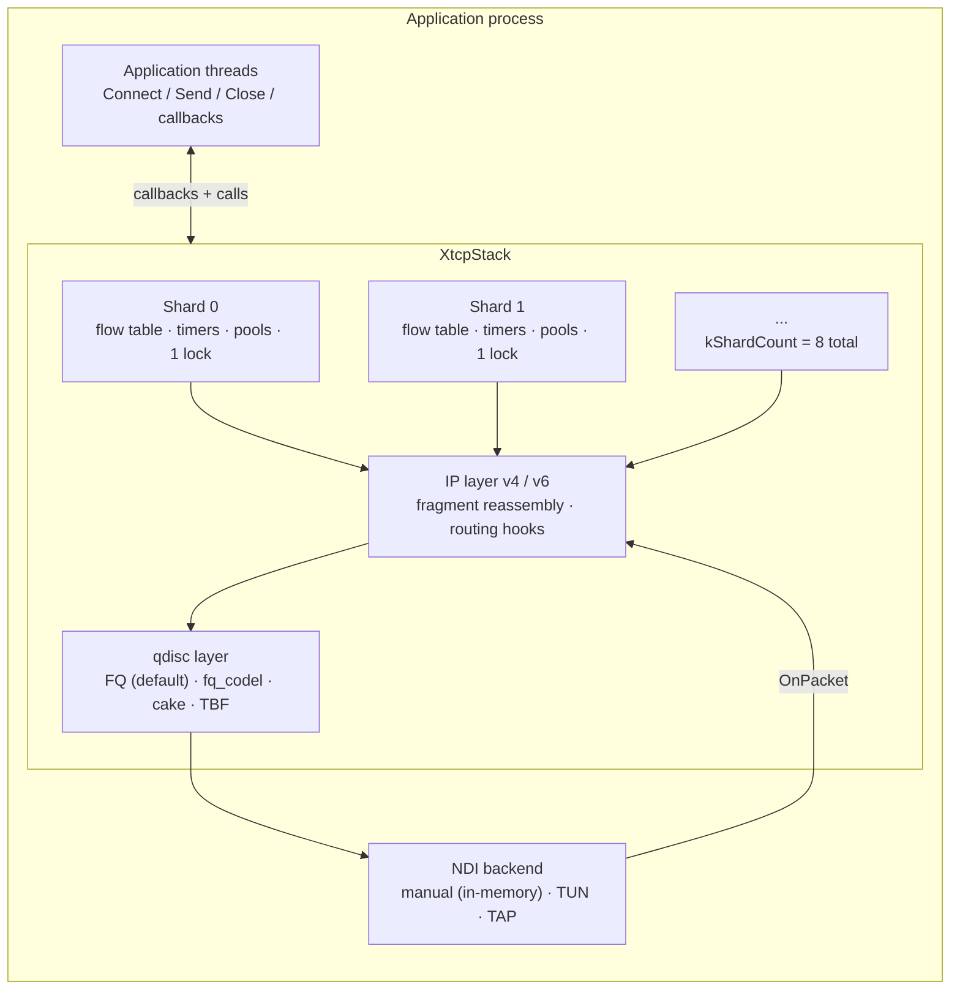

Layer responsibilities:

| Layer | Owns | Does not own |
|---|---|---|
| NDI backend | Packet I/O with the outside world | Any protocol state |
| qdisc | Egress ordering, pacing rate, AQM drops | Flow control blocks |
| IP | Addresses, fragmentation/reassembly, TTL, checksums | TCP state |
| Shard | Flow table, timers, buffer pools for its flows | Other shards' flows |
| TCP connection | Sequence space, windows, retransmit queue, CC state | Neighbor connections |

## 2. Threading model

XTCP does not spawn data-path threads of its own in the default
configuration. The application drives the stack from one or more threads:

- **Caller threads** invoke `Connect`, `Send`, `Close`, `Listen`. These are
  safe to call concurrently; each call takes the destination shard's lock.
- **Pump threads** deliver packets via `OnPacket` and advance time by
  calling `PollAckTimers` (delayed ACKs, RTO, persist, keepalive). A single
  thread can pump everything; multiple threads may pump different shards
  concurrently because shards do not share locks.
- The async API (`include/xtcp/async.h`) adds an event loop per stack that
  serializes completions through an `async_mutex`; it is optional.

Consequence worth stating: throughput depends on the caller pumping. The
benchmarks in PERFORMANCE.md drive the stack in tight loops; there is no
hidden worker thread producing those numbers.

## 3. Sharding and connection identity

A connection is placed once, at creation, and never migrates:

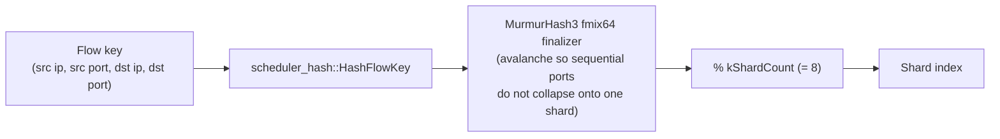

The 64-bit connection id returned by `Connect` encodes the shard in its
top byte: `(conn_id >> 56) % kShardCount` recovers the shard without any
lookup. This makes handler dispatch O(1) and lets a multi-threaded
application route work by id alone.

Why the hash finalizer matters: ephemeral ports allocated sequentially
produce keys that differ only in low bits. Without avalanche mixing, those
bits vanish under `% 8` and nearly every flow lands on shard 0. The fmix64
finalizer spreads them; `tests/test_scale_shard_balance.cpp` asserts the
distribution stays within bounds under sequential-port churn.

## 4. Receive path

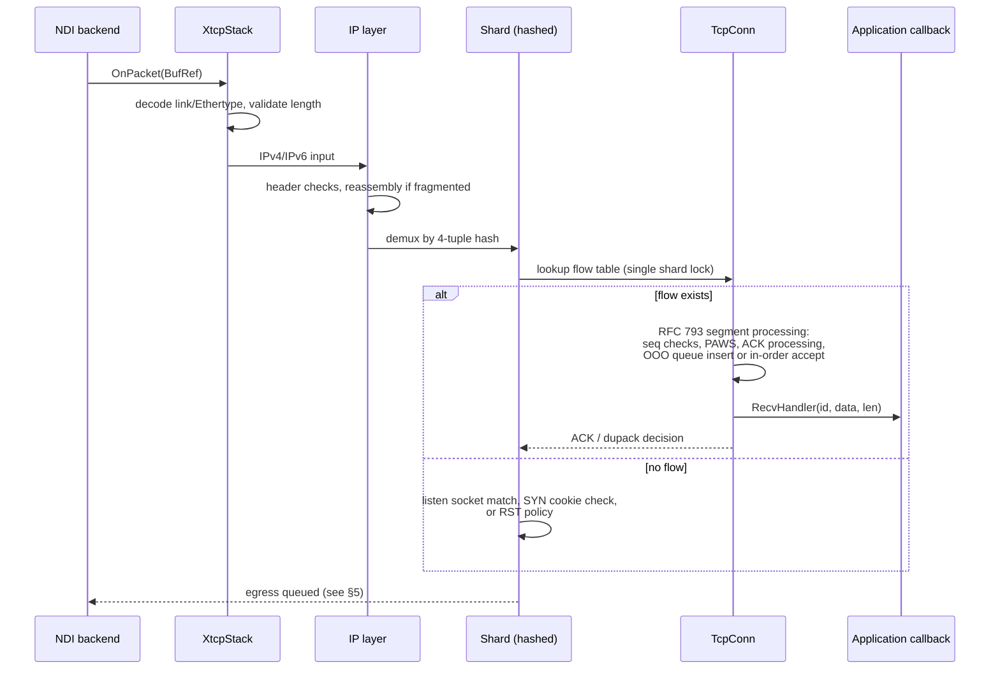

Properties that follow from this structure:

- A packet touches exactly one shard lock, once.
- Out-of-order segments are buffered up to the receive quota (default
  64 KiB per connection) and delivered in order; excess is dropped and
  recovered by retransmission, never by unbounded growth.
- Checksums are validated lazily: SIMD-accelerated (SSSE3/AVX2 on x86,
  NEON on ARM64, runtime-detected) when `XTCP_CHECKSUM_VALIDATE=ON`,
  skipped when the backend already guarantees integrity (manual backend).

## 5. Transmit path

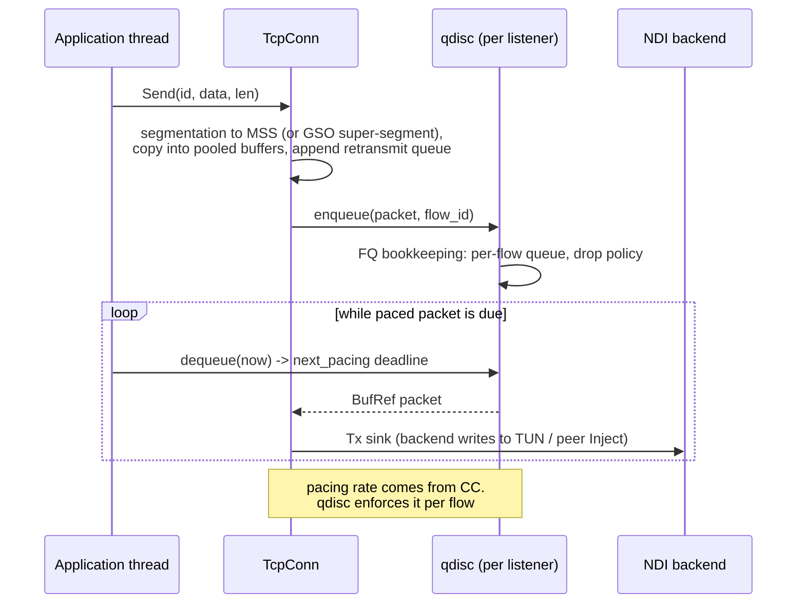

Design points:

- Segmentation happens before enqueue, so the retransmit queue holds
  exactly what must be re-sent. GSO-style large sends are split at MSS
  boundaries; the TSO path defers splitting to the backend when it can
  offload.
- The qdisc is per-listener and hot-swappable: changing fq → cake affects
  new traffic immediately and drains old queues naturally instead of
  dropping live flows.
- Per-flow pacing rates are written by congestion control and enforced by
  the qdisc's `dequeue(now, next_pacing)` contract; the stack never spins
  waiting for a pacing deadline.

## 6. Buffer management

All payload moves inside `BufRef` handles: reference-counted views into
pooled slabs. Copies happen at defined boundaries (backend ingress, user
`Send`), never between internal stages.

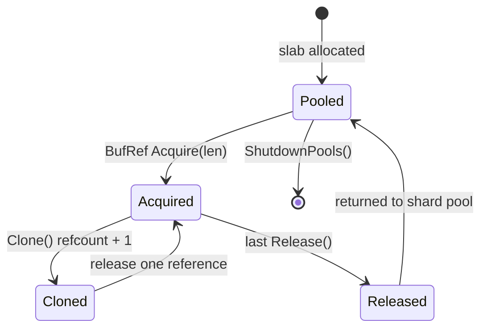

Rules the implementation enforces:

- Each shard allocates from its own pool; cross-shard handoff transfers a
  handle, so a buffer can outlive its originating shard but is accounted
  against the connection that holds it.
- Per-connection quotas bound memory: send buffer 64 KiB and out-of-order
  buffer 64 KiB by default (`kDefaultSndBuf = 65536`), i.e. roughly 129 KiB
  worst-case per live connection plus fixed block overhead.
- Pool exhaustion is a hard signal: `Acquire` returns an empty handle and
  the packet is dropped. The stack prefers dropping over growing, which is
  what makes the memory ceiling hold under flood.

## 7. TCP state machine

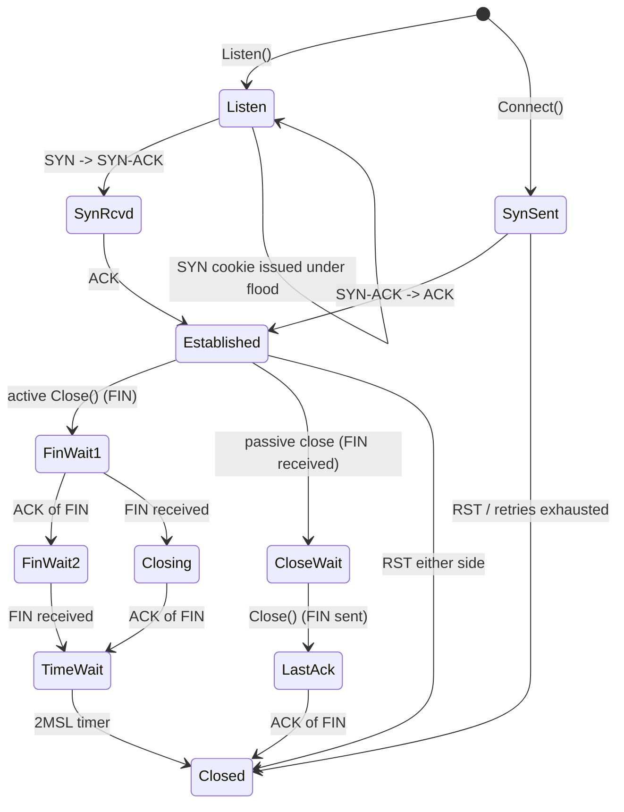

Hardening beyond the textbook machine:

- RFC 5961 challenge ACKs for blind RST/SYN attacks; out-of-window RSTs
  are answered, not obeyed.
- Data arriving on SYN-RCVD is accepted (piggybacked payloads), and data
  queued before `Established` on the client side is transmitted once the
  handshake completes (full client semantics).
- Sequence-number wraparound is handled by serial arithmetic throughout;
  dedicated tests cover wrap at both data and RST boundaries.

## 8. Loss recovery pipeline

Loss detection runs as ordered decision points after each ACK:

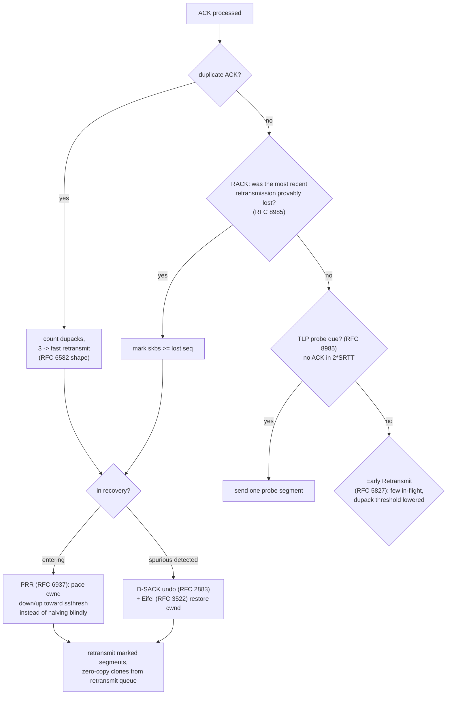

The retransmit queue stores `BufRef` handles, so retransmission clones a
reference instead of copying bytes. Spurious-retransmission detection runs
on two independent signals (D-SACK feedback and the Eifel timestamp
check); either can trigger cwnd restoration.

## 9. Congestion-control plugins

CC algorithms plug in through an operations table shaped like the Linux
kernel's `tcp_congestion_ops`, so a port starts from the kernel source and
keeps its structure:

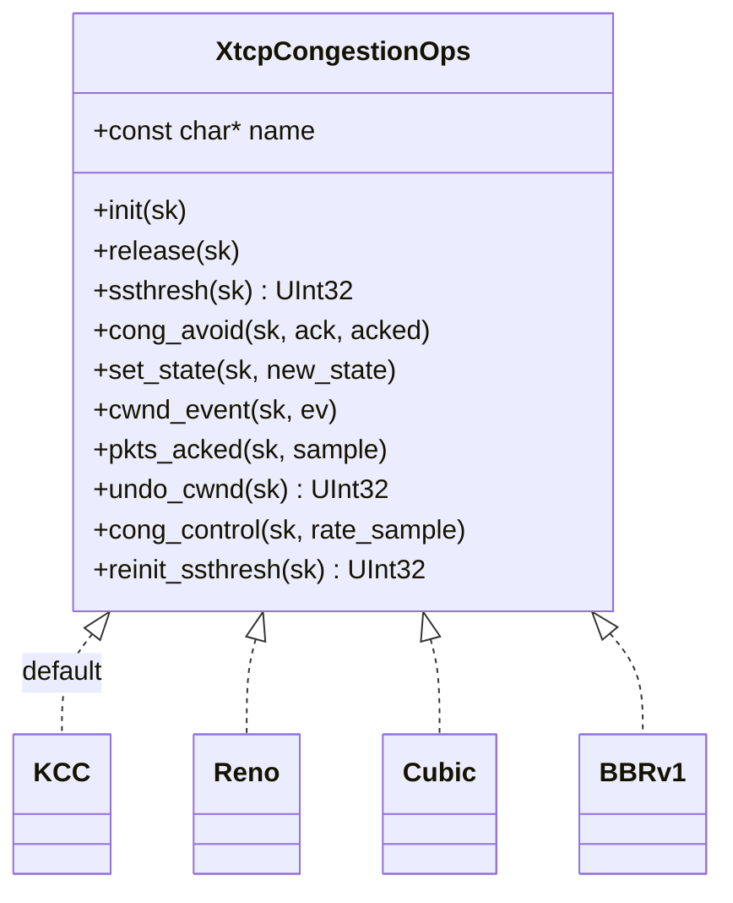

Registration is explicit and immediate: `RegisterCongestionControl(ops)`
makes an algorithm selectable by name; unregistering refuses while any
connection still uses it. Selection is per-listener, and switching
algorithms applies to new connections without touching live ones. Rate
samples (`RateSample`) feed bandwidth-delay-product algorithms like BBRv1
the same information the kernel provides.

## 10. Queueing-discipline plugins

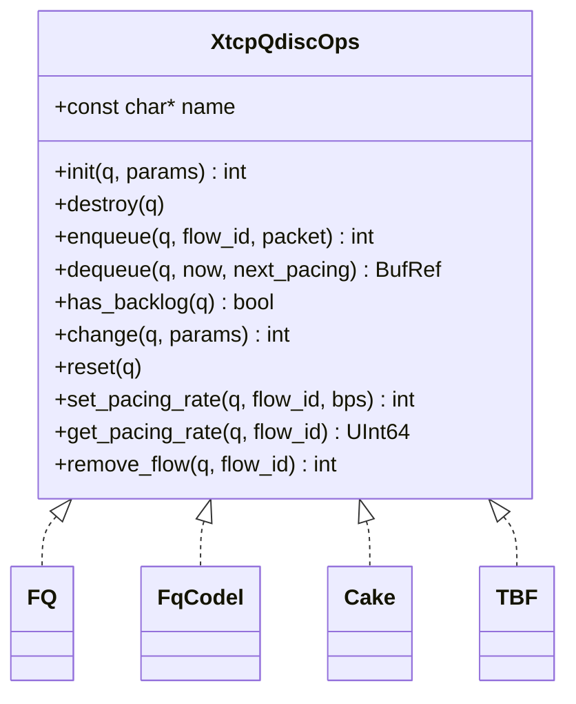

The `dequeue(now, next_pacing)` contract is the core of the integration:
the qdisc may refuse to return a packet before its pacing time and reports
when it will. The stack treats that deadline as authoritative and schedules
its next poll accordingly. `remove_flow` lets a closing connection reclaim
queued segments deterministically (the return count feeds the tx
accounting), which is what keeps close-time cleanup exact rather than
leaky.

## 11. mimt channels

mimt ("multiplexed in-memory transport") exposes TCP-like streams between
components of one process without synthesizing packets: reads and writes
move buffers directly between flow objects.

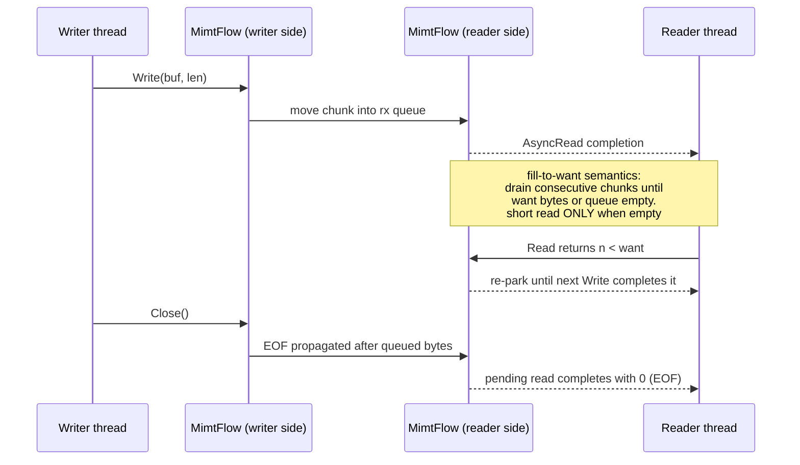

The fill-to-want rule exists because a partial completion that consumes a
parked read deadlocks callers that wait for the full length before
re-parking (this was a real deadlock found by differential ARM testing;
see TESTING.md). One accepted read gets exactly one completion.

## 12. Locking rules

There are three lock classes. The acquisition order below is global and
enforced everywhere; no other order appears in the codebase.

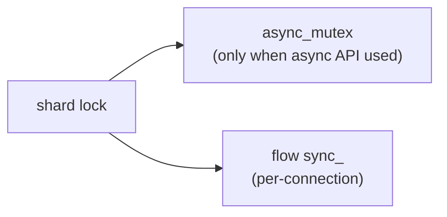

- **shard lock**: protects the flow table and shard-level accounting.
  Held for short, bounded sections.
- **flow `sync_`**: protects one connection's mutable state. Taken after
  the shard lock, never before.
- **`async_mutex`**: serializes completion delivery for the async API.
  Taken after the shard lock, never before.

Deadlock-freedom argument: the graph above has no cycles, and every
multi-lock path in `src/` acquires in the listed order (audited; see
TESTING.md for the stress tests that exercise concurrent paths).
Callbacks run outside all locks: handlers are invoked with the shard lock
released, so user code cannot deadlock the stack by calling back into it.

## 13. Design decisions and their costs

| Decision | Benefit | Cost |
|---|---|---|
| Fixed 8 shards, placement at creation | No migration races; O(1) dispatch via id | Skewed hash = skewed load; mitigated by avalanche hashing, asserted by test |
| Single lock per shard | Simple reasoning, no lock-order bugs on data path | Contention under many threads on one shard; visible in RX scaling numbers |
| Zero-copy `BufRef` everywhere | Retransmit and cross-shard transfer without copies | Handle discipline required; pool exhaustion means drops, not growth |
| Kernel-shaped plugin tables | Ports stay close to reference sources | Slightly wider interface than strictly needed |
| Virtual-clock deterministic tests | Reproducible CI; timing bugs isolated to real-time paths only | Real-time behavior needs separate measurement (PERFORMANCE.md) |
| Drop-not-grow under pressure | Hard memory ceiling per connection | Throughput degrades under extreme overload instead of latency |

## 14. What is deliberately absent

- No DPDK/EFVI backends yet: interfaces reserved, implementations not
  written. Current backends are manual (in-memory), TUN, TAP.
- No UDP, no socket-fd emulation, no POSIX shim.
- `TCP_CORK` parses and accepts but changes nothing in v1.
- Hot migration of flows between shards is designed (GOALS.md) but not
  wired into production paths.
