# 架构

> 语言：[English](ARCHITECTURE.md) | **中文**

本文描述 XTCP 的实际构造：分层、线程、数据路径、状态机、插件接口与加锁
规则。文中每一条陈述都对应 `src/` 与 `include/xtcp/` 中的代码；凡设计选择
有代价之处，代价一并写明。英文主版本：[ARCHITECTURE.md](ARCHITECTURE.md)。

## 1. 系统总览

XTCP 是进程内库，不是守护进程。一个 `XtcpStack` 实例持有一组固定分片；
每个分片独占哈希到它的全部流的可变状态。数据路径上没有共享连接表，也没有
共享锁。

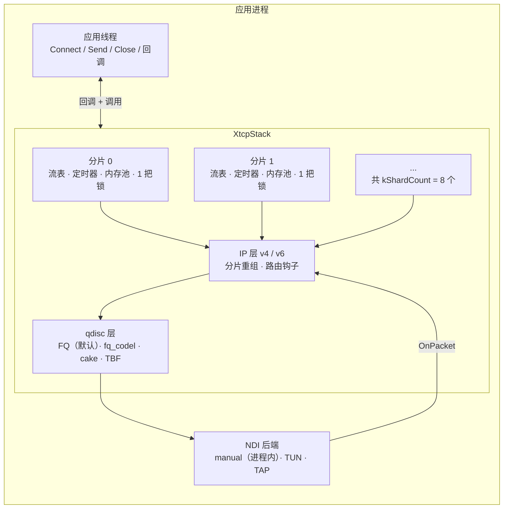

各层职责边界：

| 层 | 拥有 | 不拥有 |
|---|---|---|
| NDI 后端 | 与外部世界的报文收发 | 任何协议状态 |
| qdisc | 出向排序、pacing 速率、AQM 丢弃 | 流控制块 |
| IP | 地址、分片/重组、TTL、校验和 | TCP 状态 |
| 分片 | 其流的流表、定时器、缓冲池 | 其他分片的流 |
| TCP 连接 | 序号空间、窗口、重传队列、CC 状态 | 相邻连接 |

## 2. 线程模型

默认配置下 XTCP 不自行产生数据面线程。应用以一或多个线程驱动栈：

- **调用线程**执行 `Connect`、`Send`、`Close`、`Listen`。这些调用可并发；
  每次调用获取目标分片的锁。
- **泵线程**经 `OnPacket` 送入报文，并调用 `PollAckTimers` 推进时间
  （延迟 ACK、RTO、persist、keepalive）。单线程即可泵全部；多线程可并发
  泵不同分片，因为分片之间不共享锁。
- 异步 API（`include/xtcp/async.h`）为每个栈增加一个事件循环，用
  `async_mutex` 串行化完成事件；它是可选的。

必须言明的推论：吞吐取决于调用方的泵送。PERFORMANCE.md 的基准都在紧循环
中驱动栈——那些数字背后没有任何隐藏的工作线程。

## 3. 分片与连接标识

连接在创建时定一次位，之后永不迁移：

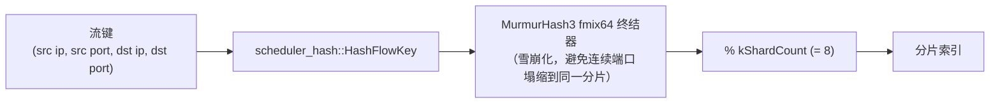

`Connect` 返回的 64 位连接 id 在最高字节编码了分片号：
`(conn_id >> 56) % kShardCount` 无需任何查找即可还原分片。这使得回调分发
为 O(1)，也让多线程应用仅凭 id 就能路由工作。

哈希终结器为何必要：顺序分配的临时端口产生的键只在低位不同。不做雪崩
混合时，这些位在 `% 8` 下消失，几乎所有流都会落到分片 0。fmix64 终结器
把它们打散；`tests/test_scale_shard_balance.cpp` 断言顺序端口扰动下的分布
保持在界内。

## 4. 接收路径

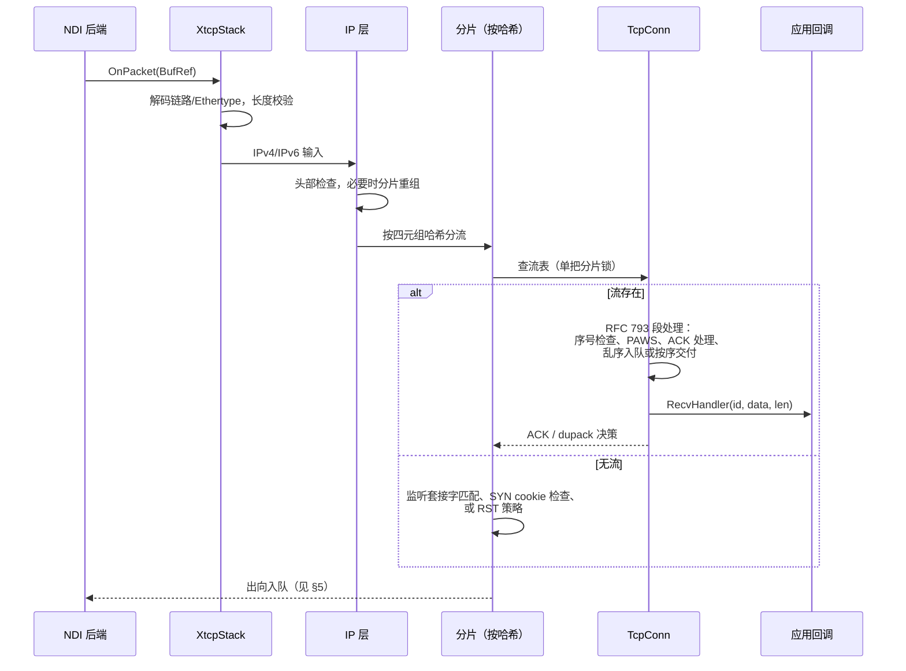

由该结构直接得到的性质：

- 一个报文恰好触碰一把分片锁，一次。
- 乱序段缓存在接收配额内（每连接默认 64 KiB），按序交付；超限即丢弃，
  由重传恢复，绝不无界增长。
- 校验和按需验证：`XTCP_CHECKSUM_VALIDATE=ON` 时启用 SIMD 加速
  （x86 用 SSSE3/AVX2，ARM64 用 NEON，运行时探测）；后端已保证完整性时
  （manual 后端）跳过。

## 5. 发送路径

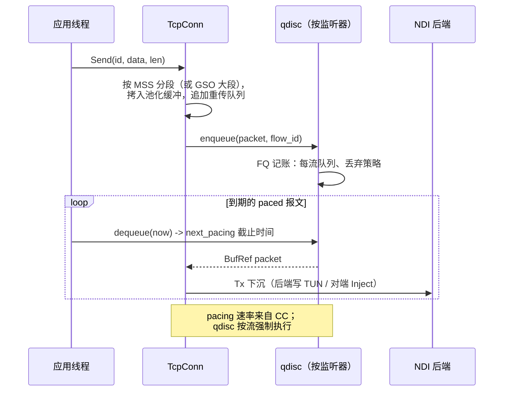

设计要点：

- 分段发生在入队之前，因此重传队列保存的正是需要重发的内容。GSO 风格的
  大块发送按 MSS 边界切分；TSO 路径在后端可卸载时推迟切分。
- qdisc 属于监听器且可热切换：fq → cake 的切换立即作用于新流量，旧队列
  自然排空而非丢弃存量流。
- 每流 pacing 速率由拥塞控制写入，由 qdisc 的
  `dequeue(now, next_pacing)` 契约强制执行；栈从不空转等待 pacing 截止。

## 6. 缓冲管理

所有载荷以 `BufRef` 句柄移动：指向池化 slab 的引用计数视图。拷贝只发生
在定义好的边界上（后端入口、用户 `Send`），内部阶段之间零拷贝。

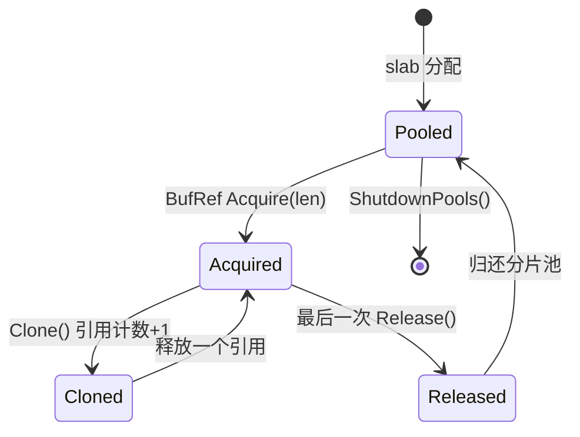

实现强制的规则：

- 每个分片从自己的池分配；跨分片交接传递句柄，缓冲可以比来源分片活得久，
  但始终记在持有它的连接账上。
- 每连接配额限定内存：默认发送缓冲 64 KiB、乱序缓冲 64 KiB
  （`kDefaultSndBuf = 65536`），即每条存活连接最坏约 129 KiB 加固定块开销。
- 池耗尽是硬信号：`Acquire` 返回空句柄，报文被丢弃。栈宁可丢包也不扩容，
  这正是洪泛下内存上限依然成立的原因。

## 7. TCP 状态机

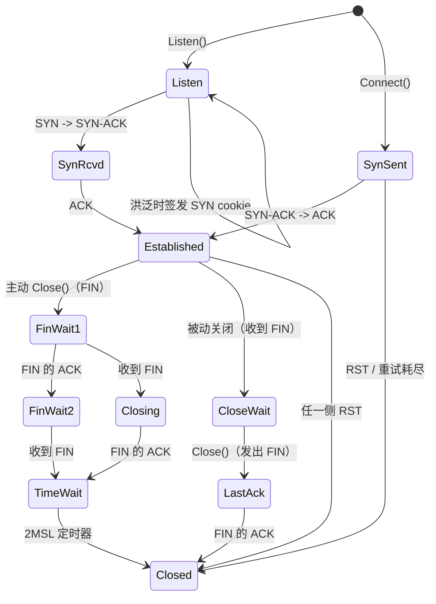

教科书状态机之外的健壮性：

- RFC 5961 对盲 RST/SYN 攻击回应 challenge ACK；窗口外的 RST 被应答而
  不是被执行。
- SYN-RCVD 上捎带的数据被接受；客户端侧在 `Established` 之前排队的数据
  在握手完成后立即发出（完整客户端语义）。
- 序号回绕全程用串行算术处理；数据与 RST 边界的回绕均有专项测试。

## 8. 丢包恢复流水线

每个 ACK 之后按固定次序运行丢包判定：

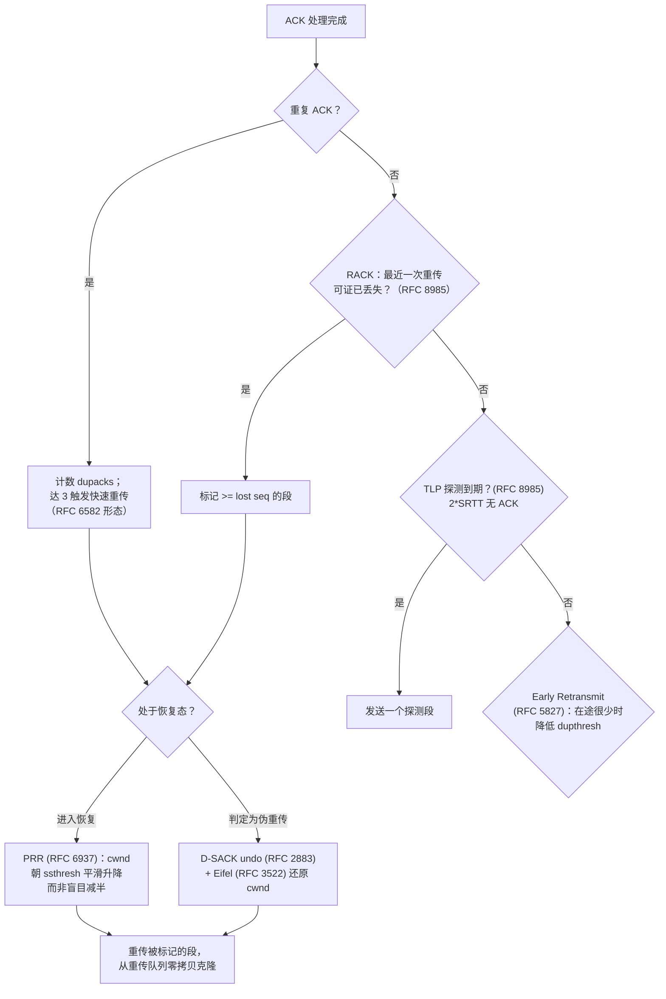

重传队列存的是 `BufRef` 句柄，重传克隆引用而不拷贝字节。伪重传检测有两条
独立信号（D-SACK 反馈与 Eifel 时间戳检查），任一都可触发 cwnd 还原。

## 9. 拥塞控制插件

CC 算法通过与 Linux 内核 `tcp_congestion_ops` 同形的操作表接入，移植工作
直接从内核源码出发并保持其结构：

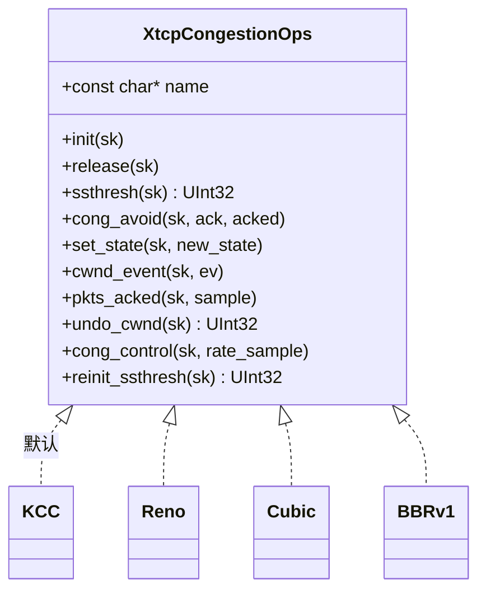

注册显式且即时生效：`RegisterCongestionControl(ops)` 使算法可按名选用；
仍有连接使用时拒绝注销。选择按监听器生效，切换算法只影响新连接，不触碰
存量连接。`RateSample` 向 BBRv1 这类带宽时延积算法提供与内核相同的信息。

## 10. 队列规则插件

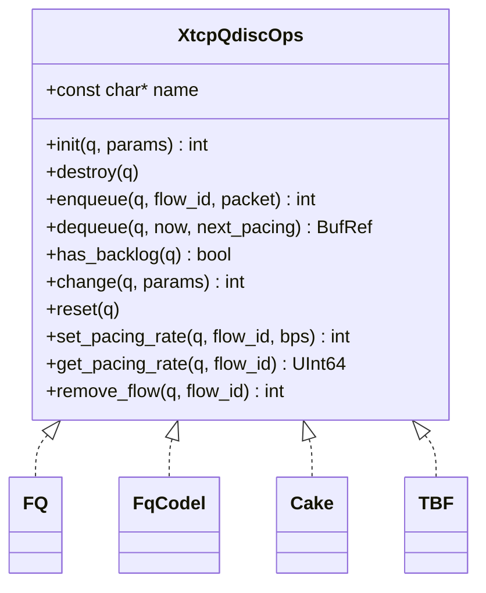

`dequeue(now, next_pacing)` 契约是集成的核心：qdisc 可以在 pacing 时间未到
时拒交报文，并报告下次可发时刻。栈视该截止时间为权威并据此安排下一次
轮询。`remove_flow` 让关闭中的连接确定性地回收排队段（返回的被丢弃段数
进入 tx 记账），这使关闭期清理精确而非泄漏。

## 11. mimt 通道

mimt（"multiplexed in-memory transport"，进程内多路传输）在同一进程的
组件间暴露类 TCP 流，不合成报文：读写直接在流对象之间移动缓冲。

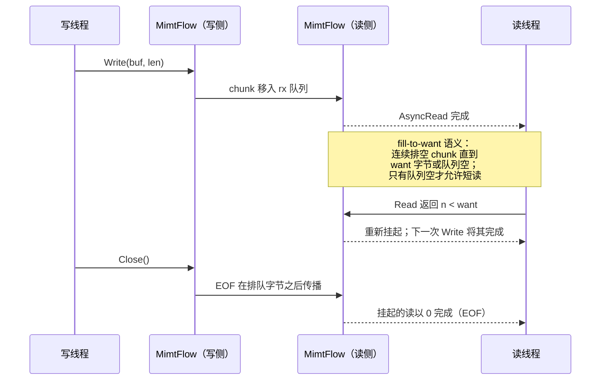

fill-to-want 规则的存在理由：部分完成若消费掉挂起的读，会让等待全长后才
重新挂起的调用方死锁（这是差分 ARM 测试发现的真实死锁；见 TESTING.md）。
一个被接受的读恰好对应一次完成。

## 12. 加锁规则

锁共三类。以下获取次序是全局的，代码中不存在其他次序。

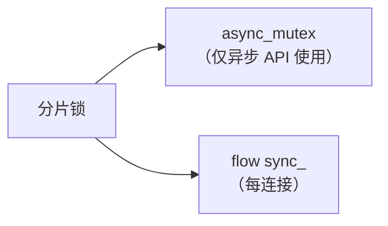

- **分片锁**：保护流表与分片级记账。持有区间短且有界。
- **flow `sync_`**：保护单连接可变状态。在分片锁之后获取，绝不在其前。
- **`async_mutex`**：串行化异步 API 的完成投递。在分片锁之后获取，绝不
  在其前。

无死锁论证：上图无环，且 `src/` 中所有多锁路径都按所列次序获取（已审计；
并发路径的压力测试见 TESTING.md）。回调在所有锁之外运行：handler 被调用
时分片锁已释放，因此用户代码回调进栈不会死锁。

## 13. 设计决策及其代价

| 决策 | 收益 | 代价 |
|---|---|---|
| 固定 8 分片，创建时定位 | 无迁移竞争；凭 id O(1) 分发 | 哈希偏斜即负载偏斜；用雪崩哈希缓解，测试断言 |
| 每分片单锁 | 推理简单，数据面无锁序问题 | 同一分片多线程时争用；RX 扩展数字中可见 |
| 全程零拷贝 `BufRef` | 重传与跨分片交接免拷贝 | 需要句柄纪律；池耗尽意味着丢弃而非增长 |
| 内核同形插件表 | 移植贴近参考源码 | 接口略宽于严格所需 |
| 虚拟时钟确定性测试 | CI 可复现；时序 bug 只可能藏在实时路径 | 实时行为需另行测量（PERFORMANCE.md） |
| 过载时丢弃而非增长 | 每连接内存硬上限 | 极端过载下吞吐退化而非延迟退化 |

## 14. 有意缺席的部分

- 尚无 DPDK/EFVI 后端：接口预留，实现未写。现有后端为 manual（进程内）、
  TUN、TAP。
- 无 UDP、无 socket-fd 仿真、无 POSIX 兼容层。
- `TCP_CORK` 可解析接受但 v1 中不改变任何行为。
- 流的分片间热迁移已有设计（GOALS.md），尚未接入生产路径。
