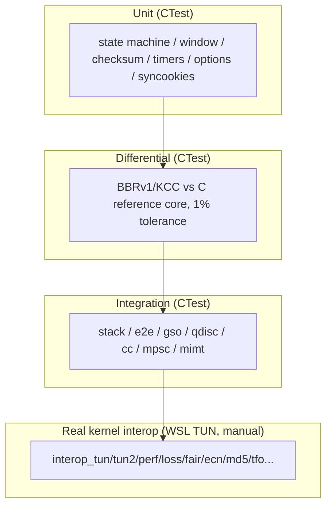

# XTCP Test Plan (TEST_PLAN)

> Language: **English** | [中文](TEST_PLAN_CN.md)

> English version. Chinese: `docs/TEST_PLAN_CN.md`.

## 1. Test Pyramid

| Layer | Content | Tooling |
|---|---|---|
| Unit | State machine / window / checksum / timers / flow-table boundaries / option parsing / syncookies / migration checkpoint | Per-test executables, CTest |
| Fidelity differential | BBRv1/KCC ports vs extracted C reference cores: same ACK/RTT sequence, per-sample cwnd/pacing comparison (1% tolerance) | `tests/test_cc_bbr.cpp`, `test_cc_kcc.cpp` |
| FQ self-consistency | Per-flow DRR fairness (50 flows, tight balance), ordering, pacing, GSO counting, rate-change; *kernel tc fq differential requires Linux (future item)* | `tests/test_fq.cpp` |
| Fuzz | Malformed IPv4/IPv6+TCP injection into a live stack (truncated headers, oversized options, illegal flags, garbage options) | Deterministic seedable driver: 50k raw injections + 24k hostile active-conn segments + 6k IPv6 ext-header + 6k IPv4 fragment reassembly + 20k SACK flood (XTCP_FUZZ_SEED overrides the default seed) |
| Back-to-back interop | Two XtcpStack instances over manual backends: full handshake + data consistency (IPv4 + IPv6) | `tests/test_stack.cpp` |
| Stack-level | Shard/scheduler/MPSC/migration/plugin drain/qdisc FQ (fairness, pacing, GSO counting) | `test_shard`, `test_scheduler`, `test_fq`, `test_gso`, `test_plugin` |
| Kernel interop | Real-kernel bidirectional interop over a WSL2 TUN (root): see the suite below | `samples/interop_*` (run manually in WSL; no CI job) |

## 1b. Real-Kernel Interop Suite (samples/interop_*, WSL2 TUN)

All samples require root in WSL2 (`sudo timeout N./interop_*`) and are
validated against the WSL2 Linux kernel (6.18) on a real TUN device:

| Sample | Validates | Result |
|---|---|---|
| `interop_tun` | IPv4 kernel<->xtcp bidirectional byte-exact echo (256KB) | PASS |
| `interop_tun6` | IPv6 kernel<->xtcp bidirectional byte-exact echo (512KB K2X + 256KB X2K) | PASS |
| `interop_tun2` / `interop_tun2_6` | 4+4 concurrent bidirectional connections, full-duplex throughput, IPv4 + IPv6 | PASS |
| `interop_perf` / `interop_perf6` | 16MB one-way throughput vs kernel loopback (TUN-bound ~1.9 Gbps, IPv4/IPv6 parity) | PASS |
| `interop_latency` / `interop_latency6` | 2000-round RTT percentiles (mean 203.6us / p50 199.9us / p99 264.6us, IPv4/IPv6 parity) | PASS |
| `interop_fair` / `interop_fair6` | 4-flow AIMD fairness under a real tbf+netem bottleneck (Jain index) | PASS |
| `interop_frag6` | IPv6 fragment reassembly (725/725 pairs, RFC 8200 wire format) | PASS |
| `interop_md5` / `interop_md5_6` | RFC 2385 enforcement both directions (unsigned/wrong-key refused) + pinned Linux digest deviation, IPv4 + IPv6 | PASS |
| `interop_tfo` / `interop_tfo6` | Kernel TFO client early-data on the SYN + graceful no-server-TFO fallback, IPv4 + IPv6 | PASS |
| `interop_ecn` / `interop_ecn6` | RFC 3168 negotiation, CE->ECE->CWR loop, non-ECN control, IPv4 + IPv6 | PASS |
| `interop_loss` / `interop_loss6` | 2MB byte-exact under real netem loss/reorder, both directions (--tx), IPv4 + IPv6 | PASS |
| `interop_zwin` / `interop_zwin6` | Zero-window backpressure: window-0 advertisement under app backpressure, 2s stall, byte-exact resume, IPv4 + IPv6 | PASS |
| `interop_keepalive` / `interop_keepalive6` | Keepalive probes (TCP_KEEPIDLE) answered by the kernel, 1s idle + interval, no false abort, IPv4 + IPv6 | PASS |
| `interop_mimt` / `interop_mimt6` | MIMT async flows: chained AsyncRead/AsyncWrite echo, 256KB byte-exact, IPv4 + IPv6 | PASS |
| `interop_churn` / `interop_churn6` | 300 short connections (8 concurrent): byte-exact + TIME-WAIT drains to zero, IPv4 + IPv6 | PASS |
| `interop_threads` / `interop_threads6` | 8 user threads driving one stack + 8 kernel clients: byte-exact, no deadlock, drain to zero, IPv4 + IPv6 | PASS |
| `interop_qdisc` / `interop_qdisc6` | The stack's paced FQ qdisc under 4 kernel flows: byte-exact, pacing measurably active, IPv4 + IPv6 | PASS |
| `interop_cookie` | RFC 4987 stateless SYN-cookie path: cookie ISN -> kernel ACK -> rebuild, byte-exact | PASS |
| interop_tso | Real-kernel TSO: the 32712-byte super-segment leaves the TUN as ONE vnet_hdr GSO frame; the kernel segments it and a real socket receives 32712 bytes byte-exact (6/6 runs); the RFC 7323 TSopt rides the super-segment | PASS |
| interop_gro | Real-kernel 16MB RX: 11731 vnet_hdr frames byte-exact (the WSL2 tun never engages GRO - ratio 1.0x documented; the stack's GRO-RX is unit-validated by test_gro_rx) | PASS |

Documented findings from the suite (see `discover` notes):
- **Linux TCP-MD5 deviation**: the kernel signs/verifies over pseudo +
  20-byte base header + payload, EXCLUDING all options (md5(pseudo+20B+key)
  matched the wire digest exactly) - deviates from RFC 2385 (whole segment).
  An RFC-exact stack cannot handshake with this kernel when options are
  present. The stack stays RFC-exact (verified against an independent
  reference computation).
- **WSL2 has no server-side TFO**: its SYN-ACKs never carry a kind-34
  cookie even with tcp_fastopen=3 + TCP_FASTOPEN; the stack degrades per
  RFC 7413 (plain SYN, early data after handshake).
- **WSL2 cannot be driven to source-fragment an established IPv6
  connection** (dst cache ignores mtu changes, GSO bypasses the IP check,
  raw ICMPv6 sockets blocked) - fragments are delivered at the TUN read
  boundary in the exact RFC 8200 wire format instead.
- **WSL2's TUNSETOFFLOAD always fails (EINVAL even with zero flags)**: the
  ioctl is only a feature advertisement; the kernel's tun_get_user parses
  the vnet_hdr and software-GSOs the frames regardless, so the TSO path
  works end-to-end without it.
- **WSL2's tun never engages GRO on RX** (non-NAPI / no NETIF_F_GRO);
  IFF_NAPI costs ~20us of RTT for nothing and is not set.
- **Reused 4-tuples**: the kernel answers a new SYN for a tuple still in
  FIN-WAIT/TIME-WAIT with the STALE connection's ACKs, not a fresh SYN-ACK;
  interop samples randomize the client port per process.

## 2. Fidelity Gates

- **CC fidelity**: reference core (C, extracted from kernel/ucp source) vs
  C++ port, same deterministic input sequence, per-sample cwnd/pacing within
  1% tolerance.
- **FQ fidelity**: self-consistency tests (ordering / fairness / pacing /
  GSO counting) - no kernel `tc fq` differential exists; the "vs kernel
  tc fq" comparison is a documented future item (per-bucket fairness).
- **GSO consistency**: GSO segmentation vs per-segment sending, byte-identical
  reassembly.

## 3. Strict Performance Methodology (G11)

1. **Controlled environment** (Linux): CPU pinning, `performance` governor,
   irq isolation, huge pages, isolated network.
2. **Statistical rigor**: warmup excluded, steady-state windows, >= 5 repeats,
   mean/median/stddev/95% CI, predeclared outlier rule (3 sigma).
3. **Load matrix**: throughput (1/10/100/1000 flows x 64B..64KB), latency
   percentiles (p50/p99/p999/p9999 with injected 1/10/50/100 ms), scaling
   (cores 1/2/4/8/16 x flows), connection rate (conn/s).
4. **Impairment** (tc netem): loss 0/0.1/1/5% x jitter 0/1/10 ms x rate limits.
5. **Baselines**: kernel TCP (CUBIC/BBRv1/KCC module), lwIP, xtcp BBRv1 vs
   xtcp KCC, same scenario/parameters.
6. **Fairness**: intra-algorithm (RTT/throughput fairness), inter-algorithm
   (BBR<->CUBIC, KCC<->CUBIC), reusing UCP fairness scenarios.
7. **Resource metrics**: CPU%, memory peak, optional perf cache misses.
8. **Reproducibility**: scenario-driven config (YAML/JSON); CI stores raw
   results (CSV/JSON) and trend reports; performance regressions fail.

## 4. Zero-Copy Gate (G8)

- IMPLEMENTED REALITY (rewritten from the plan's original gate): the rx
  delivery is zero-copy end-to-end (a borrowed pointer into the pool block
  reaches the app callback; no memcpy), and TX hands pool buffers to the
  backend by ownership transfer. The intentional copies are: the
  borrowed-inject fallback (one memcpy at OnPacket entry when a backend
  does not hand over ownership), MIMT flow delivery (pool -> rx queue ->
  user read), and GSO segmentation (each segment's payload is copied into
  a fresh pool buffer - the IOVs reference the super-segment but the
  output buffers are per-segment). The zc_probe counters exist but are not
  wired into hot-path TUs; asserting zero hot-path memcpy is therefore
  NOT enforced - the "gate" is the copy-count table in the buf audit.
- Benchmark runs report bytes/seconds/mbps/kpps; copied-byte accounting is
  not part of any bench output.

The DMA/offload data plane is pinned by dedicated tests:

| Test | Pins |
|---|---|
| `test_tx_backpressure` | DMA ring-full deferral: rejected packets go to a per-shard FIFO retry queue (ownership retained), drained before new sends; byte-exact recovery when the ring reopens; phase 2 runs the same exercise through a mounted FQ qdisc with a live shard-attribution pin (every emitted packet resolves to its connection's shard) |
| `test_zc_rxpath` | DMA RX zero-copy: every delivered payload pointer is EXACTLY the injected pool-buffer payload (64/64 pointer identity over 64KB) - the in-order delivery path performs zero copies |
| `test_gro_rx` | GRO RX: the stack consumes NIC-coalesced super-segments (13-16 multi-segment runs, ~2x fewer app callbacks than the uncoalesced baseline), byte-exact, with a pool-blocked-flush fallback that never loses bytes |
| `test_tso_tx` | TSO TX: a 32712-byte super-segment goes to the backend in ONE Tx call (the NIC segments), never software-GSO'd; ring-closed deferral holds it whole and drains it as ONE Tx; the reentrant-ACK path reaps the super instantly, so a second send can land INSIDE the ACK-clock pacing window - the test waits it out before sending (the pacing gate would otherwise flush the TSO-direct as MSS segments) |
| `test_tso_rto` | TSO RTO recovery: a lost ACK re-emits the WHOLE super-segment in one further Tx call (the TSO path survives recovery), byte-exact convergence |
| `test_ts_paws` | RFC 7323 PAWS: an in-order segment with a stale TSval is silently dropped at the exact receive frontier; the fresh stream continues (the TLP probe's dup-ACK arms the ACK-clock pacing, whose deadline can briefly gate a second segment's flush - the test waits out the pacing window before asserting) |
| `test_ts_wrap` | RFC 7323 wrap edge: a near-2^32-wrap peer clock has its first data accepted (TsRecent anchored at the handshake); a genuinely stale segment is still dropped |
| `test_urgent` | RFC 793 SO_OOBINLINE: an URG segment's bytes arrive inline byte-exact and the urgent handler fires exactly once |

The -311 loss-recovery machinery (RFC 8985 TLP/RACK + RFC 2883
D-SACK) is pinned by dedicated tests:

| Test | Pins |
|---|---|
| `test_tlp` | RFC 8985 tail-loss probe: the LAST segment's ACK lost (a tail loss - the receiver got the data) triggers the probe at ~2xRTT (well before the RTO floor); the stream resumes byte-exact and the cwnd is never cut (a probe is a re-emission, not a loss verdict) |
| `test_rack` | RFC 8985 time-based verdict: a multi-segment tail loss is declared once the reorder window (min-RTT/4, 1ms floor) has elapsed - BEFORE the classic 3-dup threshold; a merely reordered pair that arrives inside the window is ABSORBED (no recovery, no cwnd cut) |
| `test_dsack` | RFC 2883 D-SACK: a spurious retransmission (the original was merely reordered and arrives after the retransmit) makes the peer's FIRST SACK block a duplicate at or below the cumulative frontier; the sender detects it and UNDOES the spurious recovery - the pre-cut cwnd is restored instead of limping at ssthresh |

Stack behaviors pinned by these tests:
- **RTO retransmissions carry a FRESH TSval** (RFC 7323 s5.3 / RFC 3522
  Eifel): the RTO retransmit is REBUILT with a fresh timestamp
  (rto_ts_val_, captured at the RTO entry) so the Eifel check at
  OnAckReceived can tell a REAL loss (the peer echoes the retransmission's
  TSval - no undo) from a spurious RTO (the echo is the original's TSval -
  undo the window cut). Without the fresh TSval every RTO would look
  spurious and the cwnd=1 cut would be undone unconditionally. The other
  retransmit rebuilds (SACK fast-retransmit, window trickle, persist)
  deliberately omit the TSopt - this stack sends the TSopt only on ACK
  segments and the RTO retransmit, so the peer's PAWS check never applies
  to them. All rebuilds preserve the original PSH/URG bits (RFC 1011).
- **Synchronous-backend reentrancy safety (enqueue before send)**: direct-
  send paths push the segment into the retransmission queue BEFORE the sink
  emits it. A synchronous/loopback backend delivers the peer's ACK
  reentrantly INSIDE sink_; with the old order the ACK advanced past a
  not-yet-queued segment, which was then never reaped - the RTO retransmitted
  already-ACKed data. Push-first makes a reentrant ACK see the complete
  queue and drain the segment normally.

## 5. Quality Thresholds (G4)

- All tests pass in Release and Debug.
- Zero memory leaks (ASan/LSan on Linux CI; per-test-cycle assertions).
- Zero crashes (fuzz 50k injections; UBSan).
- CI matrix: Linux GCC/Clang (Release + ASan/UBSan), Windows MSVC
  (Release + Debug).

## 6. RFC Coverage & Test Count

RFC coverage (each row pinned by at least one dedicated test; the real-kernel
interop suite in 1b validates the same behavior against the WSL2 kernel):

| RFC | Feature | Tests |
|---|---|---|
| 793 | State machine; URG / SO_OOBINLINE | `test_tcp_fsm`, `test_urgent` |
| 1122 | Host requirements (keepalive, zero-window persist) | `test_keepalive_*`, `test_zero_window_*` |
| 1323 | Window scaling | `test_wscale_*` |
| 2018 | SACK | `test_sack_*`, `test_loss_recovery` |
| 2385 | TCP-MD5 | `test_md5_*`, interop_md5 |
| 2883 | D-SACK (spurious-recovery undo) | `test_dsack` |
| 3168 | ECN | `test_ecn_*` |
| 3522 | Eifel (spurious-RTO undo) | `test_eifel` |
| 4987 | SYN cookies | `test_syncookie_*`, interop_cookie |
| 5961 | RST validation / challenge ACK | `test_rst_challenge`, `test_seqwrap_rst` |
| 6298 | RTO (Jacobson, Karn) | `test_rto_recovery`, `test_karn_rtt` |
| 6675 | SACK recovery / pipe accounting | `test_sack_gap_edge`, `test_loss_recovery` |
| 6937 | PRR proportional rate reduction | `test_fastrec_*` |
| 7323 | Timestamps (TSopt / RTTM / PAWS / wrap) | `test_ts_paws`, `test_ts_wrap`, `test_karn_rtt` |
| 7413 | TCP Fast Open | `test_tfo_*`, interop_tfo |
| 8200 | IPv6 | `test_ipv6_stack`, `test_frag6` |
| 8985 | TLP tail-loss probe + RACK time-based loss detection | `test_tlp`, `test_rack` |

Test count: 236 test executables registered per platform (Windows + WSL, plus
the ASan/LSan builds on both platforms). added `test_ts_both_sides`
and `test_ts_ooo_drain` (RFC 7323 both-sides negotiation and the
out-of-order-drain TsRecent anchor); the verified runs were
236/236 (Windows), 238/238 (WSL, incl. conditional interop/lwip targets),
236/236 with XTCP_CHECKSUM_VALIDATE=ON, both twice.
