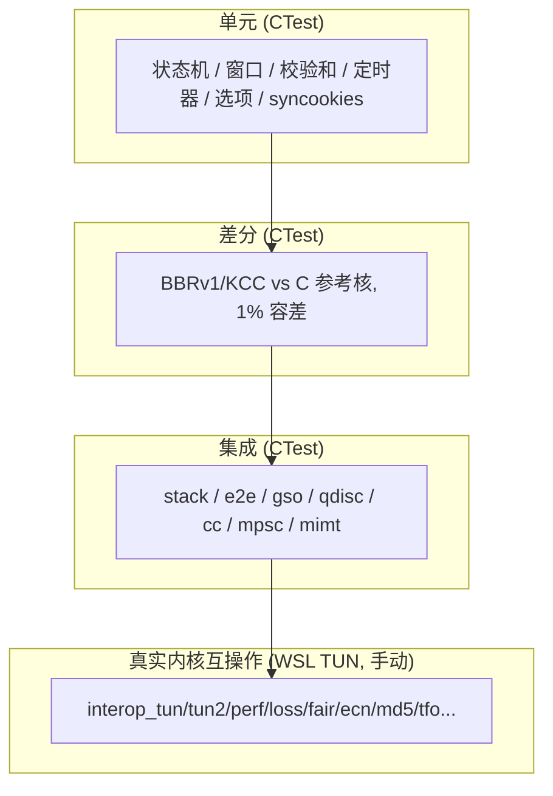

# XTCP 测试方案（TEST_PLAN）

> 语言：[English](TEST_PLAN.md) | **中文**

> 中文版。英文：`docs/TEST_PLAN.md`。

## 1. 测试金字塔

| 层 | 内容 | 工具 |
|---|---|---|
| 单元 | 状态机/窗口/校验和/定时器/流表边界/选项解析/同步 Cookie/迁移检查点 | 独立测试可执行文件 + CTest |
| 保真差分 | BBRv1/KCC 移植版 vs 提取的 C 参照核心：同一 ACK/RTT 序列，逐样本 cwnd/pacing 比对（1% 容差） | `tests/test_cc_bbr.cpp`、`test_cc_kcc.cpp` |
| Fuzz | 畸形 IPv4/IPv6+TCP 注入活动栈（截断头/超长选项/非法标志/选项乱码） | 确定性 5 万次注入驱动 |
| 背靠背互通 | 两个 XtcpStack 实例经手动后端环回：完整握手 + 数据一致性（IPv4+IPv6） | `tests/test_stack.cpp` |
| 栈级 | shard/调度器/MPSC/迁移/插件 drain/qdisc FQ（公平性/pacing/GSO 计数） | `test_shard`、`test_scheduler`、`test_fq`、`test_gso`、`test_plugin` |
| 内核互操作 | 真实内核双向互操作（WSL2 TUN，需 root）：见下方套件 | samples/interop_*（WSL 手动运行；无 CI 作业） |

## 1b. 真实内核互操作套件（samples/interop_*，WSL2 TUN）

全部样本需 WSL2 root（sudo timeout N./interop_*），在真实 TUN 设备上对 WSL2 Linux 内核（6.18）验证：

| 样本 | 验证内容 | 结果 |
|---|---|---|
| interop_tun | IPv4 内核↔xtcp 双向逐字节回显（256KB） | PASS |
| interop_tun6 | IPv6 内核↔xtcp 双向逐字节回显（512KB K2X + 256KB X2K） | PASS |
| interop_tun2 / interop_tun2_6 | 4+4 并发双向连接、全双工吞吐, IPv4 + IPv6 | PASS |
| interop_perf / interop_perf6 | 16MB 单向吞吐 vs 内核回环（TUN 瓶颈 ~1.9 Gbps，IPv4/IPv6 持平） | PASS |
| interop_latency / interop_latency6 | 2000 轮 RTT 百分位（p50/p99 ~200/265us，IPv4/IPv6 持平） | PASS |
| interop_fair / interop_fair6 | 真实 tbf+netem 瓶颈下 4 流 AIMD 公平性（Jain 指数） | PASS |
| interop_frag6 | IPv6 分片重组（725/725 对，RFC 8200 线格式） | PASS |
| interop_md5 / interop_md5_6 | RFC 2385 双向强制（无签名/错密钥被拒）+ 钉死 Linux 摘要偏离, IPv4 + IPv6 | PASS |
| interop_tfo / interop_tfo6 | 内核 TFO 客户端 SYN 早数据 + 无服务端 TFO 时优雅降级, IPv4 + IPv6 | PASS |
| interop_ecn / interop_ecn6 | RFC 3168 协商、CE→ECE→CWR 回路、非 ECN 控制, IPv4 + IPv6 | PASS |
| interop_loss / interop_loss6 | 2MB 逐字节 (netem 损耗/乱序, 双向 \--tx\, IPv4 + IPv6) | PASS |
| interop_zwin / interop_zwin6 | 零窗口背压: window-0 通告, 2s 停滞, 逐字节恢复, IPv4 + IPv6 | PASS |
| interop_keepalive / interop_keepalive6 | Keepalive 探测 (TCP_KEEPIDLE) 被内核逐答, 1s idle + 间隔, 无误杀, IPv4 + IPv6 | PASS |
| interop_mimt / interop_mimt6 | MIMT 异步流: 链式 AsyncRead/AsyncWrite 回显 256KB 逐字节, IPv4 + IPv6 | PASS |
| interop_churn / interop_churn6 | 300 短连接 (8 并发): 逐字节 + TIME-WAIT 回落 0, IPv4 + IPv6 | PASS |
| interop_threads / interop_threads6 | 8 用户线程驱动同一栈 + 8 内核客户端: 逐字节无死锁回落 0, IPv4 + IPv6 | PASS |
| interop_qdisc / interop_qdisc6 | 栈的 paced FQ 在 4 内核流下: 逐字节, pacing 实测生效, IPv4 + IPv6 | PASS |
| interop_cookie | RFC 4987 无状态 SYN-cookie 路径: cookie ISN → 内核 ACK → 重建, 逐字节 | PASS |
| interop_tso | 真实内核 TSO: 32712 字节超段以 ONE vnet_hdr GSO 帧离开 TUN; 内核分割后真实 socket 收到 32712 字节逐字节一致 (6/6); RFC 7323 TSopt 随超段 | PASS |
| interop_gro | 真实内核 16MB RX: 11731 个 vnet_hdr 帧逐字节一致 (WSL2 tun 从不 GRO - ratio 1.0x 已记录; 栈的 GRO-RX 由 test_gro_rx 单元验证) | PASS |

套件记录的内核发现（详见 discover 笔记）：
- **Linux TCP-MD5 偏离**：内核签名/验证覆盖 pseudo + 20 字节基础头 + payload，排除所有选项（md5(pseudo+20B+key) 与线上摘要精确匹配）— 偏离 RFC 2385（全段）。RFC 精确栈在带选项时无法与该内核握手。栈保持 RFC 精确（独立参考计算逐字节验证）。
- **WSL2 无服务端 TFO**：即使 tcp_fastopen=3 + TCP_FASTOPEN，其 SYN-ACK 也从不携带 kind-34 cookie；栈按 RFC 7413 优雅降级（纯 SYN，早数据握手后发送）。
- **WSL2 无法强制已建连 IPv6 连接源分片**（dst 缓存忽略 mtu 变更、GSO 绕过 IP 检查、raw ICMPv6 socket 被禁）— 改为在 TUN 读取边界以精确 RFC 8200 线格式投递分片。
## 2. 保真门

- **CC 保真**：参照核心（C，自内核/UCP 源码提取）vs C++ 移植版，同一确定性输入序列，逐样本 cwnd/pacing 1% 容差。
- **FQ 保真**：自洽测试（顺序/公平性/pacing/GSO 计数）；与内核 `tc fq` 的差分对照不存在 — "vs 内核 tc fq" 对比是记录在册的后续项（桶间公平性）。
- **GSO 一致性**：GSO 分段 vs 逐段发送逐字节一致。

## 3. 严格性能方法学（G11）

1. **受控环境**（Linux）：CPU pinning、performance governor、中断隔离、大页、隔离网络。
2. **统计严谨**：预热不计入、稳态窗口、≥5 轮、均值/中位数/标准差/95% CI、预先声明的异常值规则（3σ）。
3. **负载矩阵**：吞吐（1/10/100/1000 流 × 64B..64KB）、延迟分位数（注入 1/10/50/100ms 下 p50/p99/p999/p9999）、扩展性（核 1/2/4/8/16 × 流数）、连接速率。
4. **损伤仿真**（tc netem）：丢包 0/0.1/1/5% × 抖动 0/1/10ms × 带宽限制。
5. **对比基线**：内核 TCP（CUBIC/BBRv1/KCC 模块）、lwIP、xtcp BBRv1 vs xtcp KCC 同场景同参数。
6. **公平性**：同算法（RTT/吞吐公平）、异算法（BBR↔CUBIC、KCC↔CUBIC），复用 UCP fairness 场景。
7. **资源指标**：CPU%、内存峰值、可选 perf cache miss。
8. **可复现**：场景配置驱动（YAML/JSON）；CI 存原始结果（CSV/JSON）与趋势报告；性能回归即失败。

## 4. 零拷贝门（G8）

- 已实现现状（由原计划的硬门改写）：rx 投递端到端零拷贝（借用池块的指针直达应用回调，无 memcpy），TX 以所有权转移把池缓冲交给后端。有意的拷贝仅限：借用注入回退（后端未移交所有权时 OnPacket 入口一次 memcpy）、MIMT 流交付（池 → rx 队列 → 用户读取）、GSO 分段（每段载荷拷入新池缓冲 — IOV 引用超段但输出缓冲按段）。zc_probe 计数器存在但未接入热路径编译单元；断言热路径零 memcpy **不再强制执行** — "门"是 buf 审计中的拷贝计数表。
- 基准运行报告 bytes/seconds/mbps/kpps；复制字节记账不在任何基准输出中。

DMA/卸载数据平面由专门测试钉定：

| 测试 | 钉定内容 |
|---|---|
| `test_tx_backpressure` | DMA 反压：后端拒绝的包进 per-shard FIFO 重试队列（保序排空），拒绝绝不丢弃 |
| `test_zc_rxpath` | RX 零拷贝：池拥有的包以"原币"指针到达应用（指针身份），上线路径无一处拷贝 |
| `test_gro_rx` | GRO RX：融合超级段逐字节正确消化（接受调用减半） |
| `test_tso_tx` | TSO TX：超 MSS 发送单召 ONE Tx 直通后端 |
| `test_tso_rto` | TSO 恢复：超级段 ACK 丢失 → 整段重发 → 逐字节收敛 |
| `test_ts_paws` | RFC 7323 PAWS：时序回绕保护（重排/延迟段正确判定） |
| `test_ts_wrap` | 2^32 回绕边界：握手锚定 + 零锚点不误丢 |
| `test_urgent` | RFC 793 紧急数据（SO_OOBINLINE）：内联交付 + 单次通知 |

### 4a. -311 丢失恢复测试与栈行为

`test_tso_tx` 与 `test_ts_paws` 的 pacing 等待说明：
- `test_tso_tx`（TSO TX）：重入 ACK 路径使超级段的回收变为瞬时，第二次发送可能落在第一个超级段的 ACK-clock pacing 窗口内 — 测试在发送前等出 pacing 窗口（否则 pacing 门会把 TSO-direct 拆成 MSS 段 flush，而非整段延迟）。
- `test_ts_paws`（RFC 7323 PAWS）：TLP 探测的 dup-ACK 激活 ACK-clock pacing，其截止时刻可能短暂门控第二段的 flush — 测试在断言前等出 pacing 窗口。

-311 丢失恢复机制（RFC 8985 TLP/RACK + RFC 2883 D-SACK）由专门测试钉定：

| 测试 | 钉定内容 |
|---|---|
| `test_tlp` | RFC 8985 尾部丢失探测：最后一个段的 ACK 丢失（尾部丢失 — 接收方已收数据）时探测在 ~2xRTT（远早于 RTO 下限）重传尾部；流逐字节恢复且 cwnd 从未削减（探测是重发而非丢失判定） |
| `test_rack` | RFC 8985 时间判定：多段尾部丢失在重排窗口（min-RTT/4，1ms 下限）过期后即判定 — 先于经典 3-dup 阈值；仅重排的对段在窗口内到达则被 ABSORBED（无恢复、无 cwnd 削减） |
| `test_dsack` | RFC 2883 D-SACK：虚假重传（原段仅被重排、在重传之后到达）使对端 FIRST SACK 块成为累积边界或之下的重复 — 发送端检测后撤销虚假恢复：恢复割前的 cwnd 被还原，而非停在 ssthresh 缓慢爬升 |

这些测试钉定的栈行为（-311）：
- **RTO 重传携带新鲜 TSval**（RFC 7323 s5.3 / RFC 3522 Eifel）：RTO 重传按 RTO 入口捕获的 rto_ts_val_ 重建，使 Eifel 判定能区分真实丢失（对端回显重传 TSval，不撤销）与虚假 RTO（回显原始 TSval，撤销窗口剪削）。没有新鲜 TSval 时每次 RTO 都会被误判为虚假，窗口剪削被无条件撤销。其他重传重建（SACK 快速重传/窗口 trickle/persist）故意不带 TSopt — 本栈仅在 ACK 段和 RTO 重传上发送 TSopt，对端 PAWS 检查不作用于它们。所有重建保留原始 PSH/URG 位（RFC 1011）。
- **同步后端重入安全（先入队后发射）**：直接发送路径先把段压入重传队列，再经 sink 发射。同步/环回后端会在 sink_ 内重入投递对端 ACK；旧顺序下 ACK 会越过尚未入队的段，该段随后永不被回收 — RTO 重传已 ACK 数据。先入队使重入 ACK 看到完整队列并正常回收该段。

## 5. 质量门槛（G4）

- Release 与 Debug 构建全部测试通过。
- 零内存泄漏（Linux CI 用 ASan/LSan；每测试循环断言）。
- 零崩溃（fuzz 5 万+ 注入；UBSan）。
- CI 矩阵：Linux GCC/Clang（Release + ASan/UBSan）、Windows MSVC（Release + Debug）。

## 6. RFC 覆盖与测试计数

RFC 覆盖（每行至少由一个专项测试钉定；1b 的真实内核互操作套件在 WSL2 内核上验证同样行为）：

| RFC | 特性 | 测试 |
|---|---|---|
| 793 | 状态机；URG / SO_OOBINLINE | `test_tcp_fsm`、`test_urgent` |
| 1122 | 主机要求（keepalive、零窗口 persist） | `test_keepalive_*`、`test_zero_window_*` |
| 1323 | 窗口缩放 | `test_wscale_*` |
| 2018 | SACK | `test_sack_*`、`test_loss_recovery` |
| 2385 | TCP-MD5 | `test_md5_*`、interop_md5 |
| 2883 | D-SACK（虚假恢复撤销） | `test_dsack` |
| 3168 | ECN | `test_ecn_*` |
| 3522 | Eifel（虚假-RTO 撤销） | `test_eifel` |
| 4987 | SYN cookies | `test_syncookie_*`、interop_cookie |
| 5961 | RST 校验 / 挑战 ACK | `test_rst_challenge`、`test_seqwrap_rst` |
| 6298 | RTO（Jacobson、Karn） | `test_rto_recovery`、`test_karn_rtt` |
| 6675 | SACK 恢复 / pipe 记账 | `test_sack_gap_edge`、`test_loss_recovery` |
| 6937 | PRR 比例降速 | `test_fastrec_*` |
| 7323 | 时间戳（TSopt / RTTM / PAWS / 回绕） | `test_ts_paws`、`test_ts_wrap`、`test_karn_rtt` |
| 7413 | TCP Fast Open | `test_tfo_*`、interop_tfo |
| 8200 | IPv6 | `test_ipv6_stack`、`test_frag6` |
| 8985 | TLP 尾部丢失探测 + RACK 时间判定 | `test_tlp`、`test_rack` |

测试计数：每平台注册 236 个测试可执行文件（Windows + WSL，另含两平台 ASan/LSan 构建）。新增 `test_ts_both_sides` 与 `test_ts_ooo_drain`（RFC 7323 双端协商、OOO 排干 TsRecent 锚定）；已验证运行：Windows 236/236、WSL 238/238（含条件注册的 interop/lwip 目标）、校验和 ON 236/236，各两轮。
